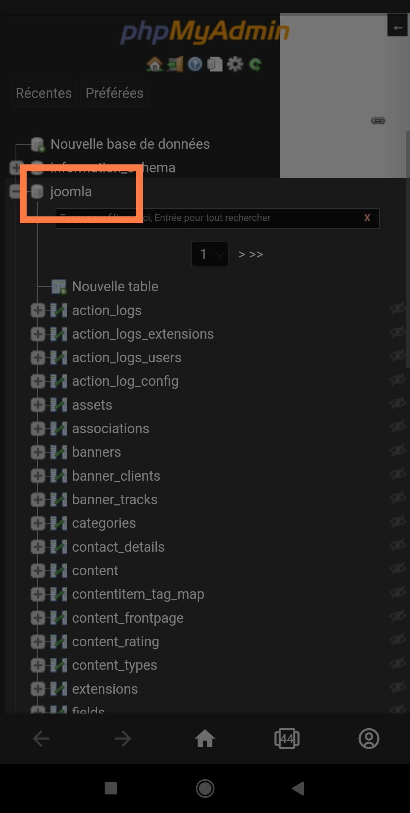
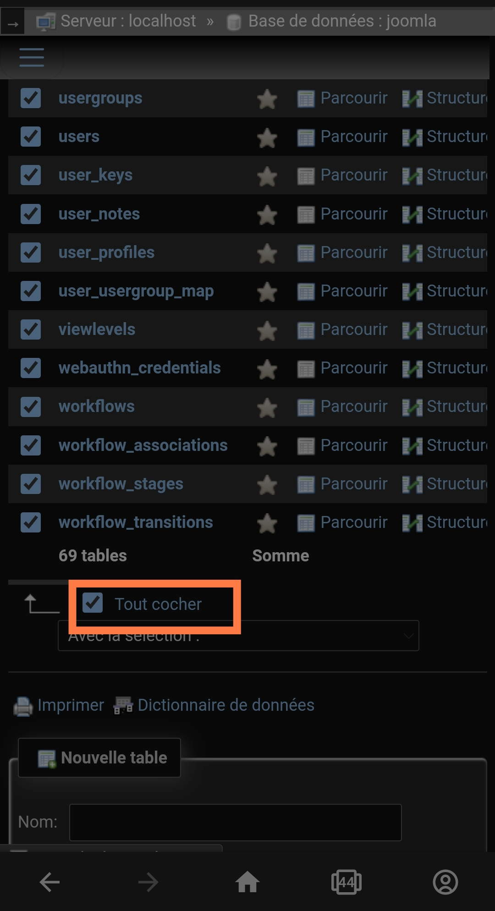
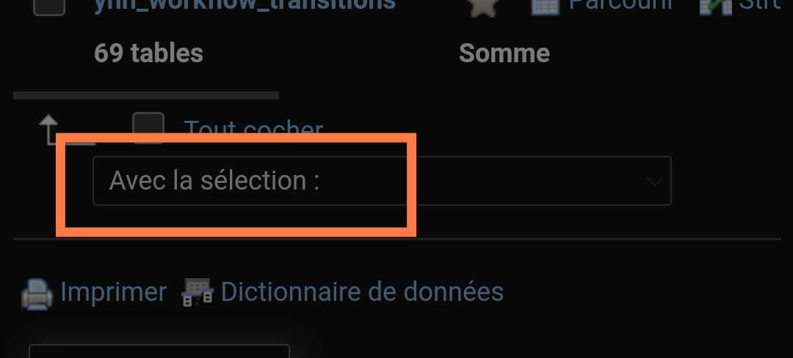
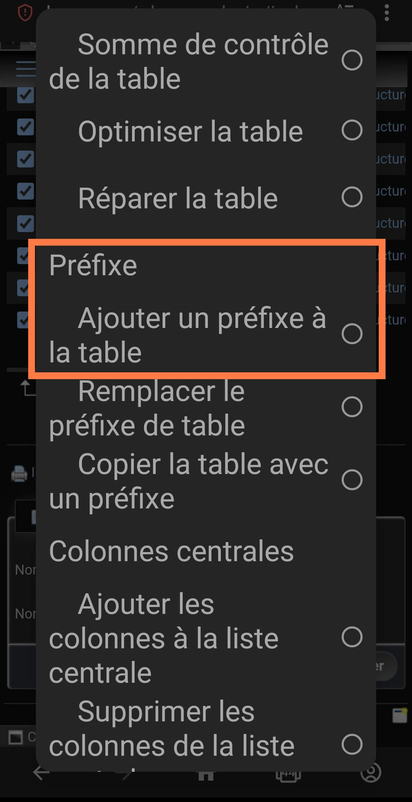
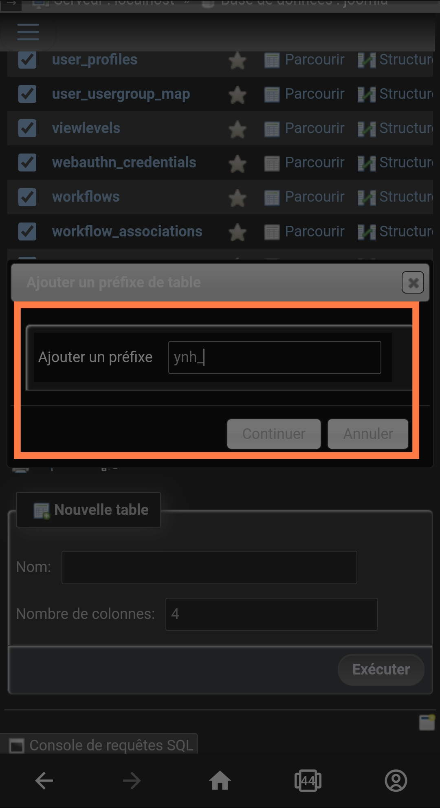
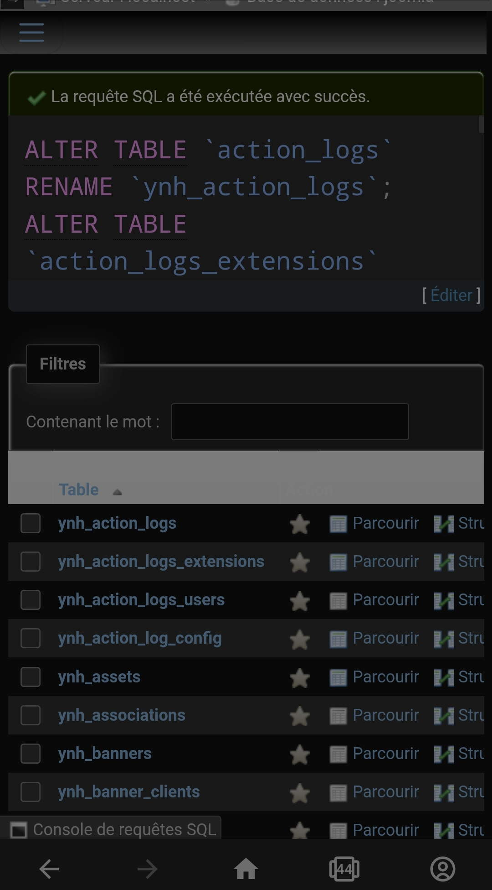

<!--
N.B.: This README was automatically generated by https://github.com/YunoHost/apps/tree/master/tools/README-generator
It shall NOT be edited by hand.
-->

# Joomla pour YunoHost

[](https://dash.yunohost.org/appci/app/joomla)    
[](https://install-app.yunohost.org/?app=joomla)

*[Read this readme in english.](./README.md)*

> *Ce package vous permet d'installer Joomla rapidement et simplement sur un serveur YunoHost.
Si vous n'avez pas YunoHost, regardez [ici](https://yunohost.org/#/install) pour savoir comment l'installer et en profiter.*

## Vue d'ensemble

Joomla! is a free and open-source content management system (CMS) for publishing web content. Over the years Joomla! has won several awards. It is built on a model–view–controller web application framework that can be used independently of the CMS that allows you to build powerful online applications.


**Version incluse :** 4.2.0~ynh1

## Captures d'écran


## Avertissements / informations importantes

# Ldap configuration (For now you have to configure it yourself)
Enable ldap Extension<br>
Enter the following feilds:<br>
**Host:** localhost<br>
**Port**:389<br>
**LdapV3:** Yes<br>
**Authorisation Method:** Bind and search<br>
**Base DN:** dc=yunohost,dc=org<br>
**uid:** uid=[search]<br>
**User's DN:** ou=users,dc=yunohost,dc=org<br>
**Map Full Name:** displayname<br>
**Map Email:** mail<br>
**Map User ID:** uid<br>

# UPDATE TO 4.1.0 REQUIRES MANUAL FIX WITH PHPMYADMIN

1. Run phpmyadmin after applying the update

2. Select 'joomla' database in the left panel



3. Select all tables in the right panel



4. Clic on the action menu



5. Clic add prefix to table



6. Enter the database prefix you see in the error message of joomla :
```
Table 'joomla.JuzW_menu' doesn't exist
```
it looks like 'JuzW_' in the prefix box and validate



7. You're done, all tables are prefixed with your prefix



## Documentations et ressources

* Site officiel de l'app : <https://www.joomla.org/>
* Documentation officielle de l'admin : <https://docs.joomla.org/>
* Dépôt de code officiel de l'app : <https://github.com/joomla/joomla-cms>
* Documentation YunoHost pour cette app : <https://yunohost.org/app_joomla>
* Signaler un bug : <https://github.com/YunoHost-Apps/joomla_ynh/issues>

## Informations pour les développeurs

Merci de faire vos pull request sur la [branche testing](https://github.com/YunoHost-Apps/joomla_ynh/tree/testing).

Pour essayer la branche testing, procédez comme suit.

``` bash
sudo yunohost app install https://github.com/YunoHost-Apps/joomla_ynh/tree/testing --debug
ou
sudo yunohost app upgrade joomla -u https://github.com/YunoHost-Apps/joomla_ynh/tree/testing --debug
```

**Plus d'infos sur le packaging d'applications :** <https://yunohost.org/packaging_apps>
