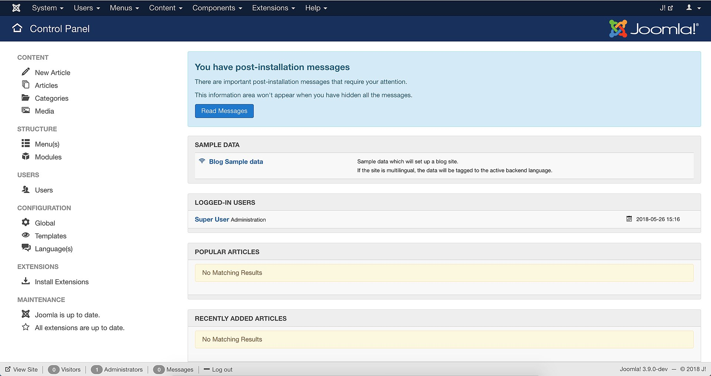

<!--
Nota bene : ce README est automatiquement généré par <https://github.com/YunoHost/apps/tree/master/tools/readme_generator>
Il NE doit PAS être modifié à la main.
-->

# Joomla pour YunoHost

[](https://dash.yunohost.org/appci/app/joomla)  

[](https://install-app.yunohost.org/?app=joomla)

*[Lire le README dans d'autres langues.](./ALL_README.md)*

> *Ce package vous permet d’installer Joomla rapidement et simplement sur un serveur YunoHost.*  
> *Si vous n’avez pas YunoHost, consultez [ce guide](https://yunohost.org/install) pour savoir comment l’installer et en profiter.*

## Vue d’ensemble

Joomla! est un système de gestion de contenu (CMS) gratuit et open source pour la publication de contenu Web. Au fil des années, Joomla! a remporté plusieurs prix. Il est construit sur un cadre d'application Web modèle-vue-contrôleur qui peut être utilisé indépendamment du CMS et qui vous permet de créer de puissantes applications en ligne.


**Version incluse :** 4.4.3~ynh1

## Captures d’écran



## :red_circle: Anti-fonctionnalités

- **Paquet non maintenu**: Ce package YunoHost n'est plus maintenu et doit être adopté.

## Documentations et ressources

- Site officiel de l’app : <https://www.joomla.org/>
- Documentation officielle de l’admin : <https://docs.joomla.org/>
- Dépôt de code officiel de l’app : <https://github.com/joomla/joomla-cms>
- YunoHost Store : <https://apps.yunohost.org/app/joomla>
- Signaler un bug : <https://github.com/YunoHost-Apps/joomla_ynh/issues>

## Informations pour les développeurs

Merci de faire vos pull request sur la [branche `testing`](https://github.com/YunoHost-Apps/joomla_ynh/tree/testing).

Pour essayer la branche `testing`, procédez comme suit :

```bash
sudo yunohost app install https://github.com/YunoHost-Apps/joomla_ynh/tree/testing --debug
ou
sudo yunohost app upgrade joomla -u https://github.com/YunoHost-Apps/joomla_ynh/tree/testing --debug
```

**Plus d’infos sur le packaging d’applications :** <https://yunohost.org/packaging_apps>
