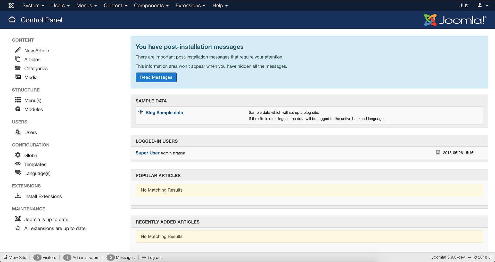

<!--
NB: Deze README is automatisch gegenereerd door <https://github.com/YunoHost/apps/tree/master/tools/readme_generator>
Hij mag NIET handmatig aangepast worden.
-->

# Joomla voor Yunohost

[](https://ci-apps.yunohost.org/ci/apps/joomla/)


[](https://install-app.yunohost.org/?app=joomla)

*[Deze README in een andere taal lezen.](./ALL_README.md)*

> *Met dit pakket kun je Joomla snel en eenvoudig op een YunoHost-server installeren.*  
> *Als je nog geen YunoHost hebt, lees dan [de installatiehandleiding](https://yunohost.org/install), om te zien hoe je 'm installeert.*

## Overzicht

Joomla! is a free and open-source content management system (CMS) for publishing web content. Over the years Joomla! has won several awards. It is built on a model–view–controller web application framework that can be used independently of the CMS that allows you to build powerful online applications.


**Geleverde versie:** 5.2.5~ynh1

## Schermafdrukken



## :red_circle: Anti-eigenschappen

- **Package not maintained**: This YunoHost package is not actively maintained and needs adoption. This means that minimal maintenance is made by volunteers who don't use the app, so you should expect the app to lose reliability over time. You can [learn how to package](https://yunohost.org/packaging_apps_intro) if you'd like to adopt it.

## Documentatie en bronnen

- Officiele website van de app: <https://www.joomla.org/>
- Officiele beheerdersdocumentatie: <https://docs.joomla.org/>
- Upstream app codedepot: <https://github.com/joomla/joomla-cms>
- YunoHost-store: <https://apps.yunohost.org/app/joomla>
- Meld een bug: <https://github.com/YunoHost-Apps/joomla_ynh/issues>

## Ontwikkelaarsinformatie

Stuur je pull request alsjeblieft naar de [`testing`-branch](https://github.com/YunoHost-Apps/joomla_ynh/tree/testing).

Om de `testing`-branch uit te proberen, ga als volgt te werk:

```bash
sudo yunohost app install https://github.com/YunoHost-Apps/joomla_ynh/tree/testing --debug
of
sudo yunohost app upgrade joomla -u https://github.com/YunoHost-Apps/joomla_ynh/tree/testing --debug
```

**Verdere informatie over app-packaging:** <https://yunohost.org/packaging_apps>
